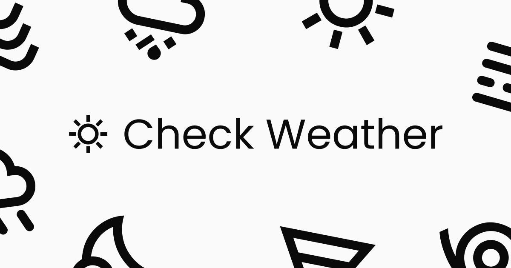

<div align="center">
  

  <h1>☀ Check Weather - v1</h1>

  <p>Consult your local weather info!</p>

<a href="https://go-check-weather.vercel.app" target="_blank">Access the app</a>

</div>

---

## 🛠️ Stack

- [React.js](https://react.dev/)
- [Next.js](https://nextjs.org/)
- [Tailwindcss](https://tailwindcss.com/)
- [Framer Motion](https://www.framer.com/motion/)
- [Jest](https://jestjs.io/)

## 💭 Motivation

Check Weather is a Progressive Web App (PWA) that provides current weather forecasts based on the user's location.

Its main objective is to serve as a study project for front-end development. In this project, I explored the caching functionality of server-side generated pages using Next.js to provide forecasts for as many locations as possible while minimizing the consumption of the OpenWeather API. Additionally, I studied the configuration of CI workflows on GitHub to execute tests on new pull requests.

## ✅ Prerequisites

Make sure you have [Node.js](https://nodejs.org/) and [Yarn](https://yarnpkg.com/) installed.

## 💻 Run project

1. Clone repository:

   ```sh
   git clone https://github.com/luis-grizzo/check-weather.git
   ```

2. go to project directory:

   ```sh
   cd check-weather
   ```

3. Install dependencies:

   ```sh
   yarn install
   ```

4. Run development server:
   ```sh
   yarn dev
   ```

## :memo: License

This project is under the MIT license. See [LICENSE](https://github.com/luis-grizzo/new-challenge-trinca/blob/main/LICENSE) for more information.

---

👨‍🦱 Developed by **Luís Grizzo** - **Contact:** <a href="https://www.linkedin.com/in/luis-grizzo/">Linkedin</a>
